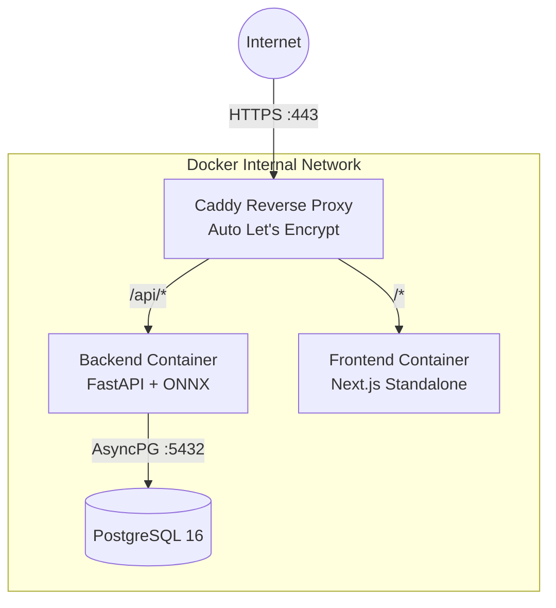

# SPEC: Hạ Tầng, Triển Khai & CI/CD (Infrastructure & Automation)

## 1. Mục Tiêu (Intent)
Tự động hóa luồng kiểm định chất lượng (Quality Gates) để đảm bảo không có bất kỳ dòng code lỗi nào được merge vào nhánh chính. Cung cấp cơ chế triển khai (Deployment) zero-downtime và khả năng rollback nhanh chóng cho kiến trúc Micro-Containerized Monolith (Caddy + FastAPI + Next.js).

## 2. Kiến Trúc Hạ Tầng (Infrastructure Topology)

Toàn bộ hệ thống được đóng gói bằng Docker và chạy trên 1 VPS duy nhất (Ubuntu 22.04, 2 Core, 4GB RAM) thông qua `docker-compose`.

## 3. Đường Ống CI (Continuous Integration)

Sử dụng **GitHub Actions** (`.github/workflows/ci.yml`). Bất kỳ Pull Request nào cũng phải vượt qua 5 cổng kiểm định (Quality Gates) tương ứng với các luật trong `CONSTRAINTS.md`:

### 3.1. Các bước chạy song song (Parallel Jobs) để tối ưu tốc độ $< 5$ phút:

1. **Gate 1: Lint & Format (Frontend + Backend)**
   - Chạy `ruff check .` và `ruff format --check` cho Python.
   - Chạy `eslint .` và `prettier --check` cho TypeScript.
2. **Gate 2: Type Checking**
   - Chạy `mypy app/` (Backend).
   - Chạy `tsc --noEmit` (Frontend).
3. **Gate 3: Security & Secrets**
   - Quét mã độc thư viện: `osv-scanner scan -r .`
   - Quét rò rỉ API Key: `gitleaks detect --redact`
4. **Gate 4: Unit Testing & Coverage**
   - Khởi tạo Database Postgres tạm thời (Service Container) cho CI.
   - Chạy `pytest --cov=app` (Bắt buộc pass $80\%$ coverage trên code mới).
   - Chạy `vitest run` (Cho Frontend).
5. **Gate 5: Build Check**
   - Chạy `docker-compose build` để đảm bảo Dockerfile không bị lỗi cú pháp.

*(Chỉ khi toàn bộ 5 cổng này báo Xanh $\to$ Nút Merge PR mới được bật sáng).*

## 4. Đường Ống CD (Continuous Deployment)

Áp dụng chiến lược **Push-to-Deploy** đơn giản gọn nhẹ cho quy mô Đồ án:

1. **Kích hoạt:** Khi PR được merge vào nhánh `main`.
2. **Action CD:**
   - GitHub Actions SSH vào VPS Production (qua `appleboy/ssh-action`).
   - Kéo code mới nhất (`git pull`).
   - Xây dựng lại container: `docker-compose build`.
   - Khởi động lại hệ thống không gián đoạn: `docker-compose up -d --no-deps --build`.
   - Chạy Database Migration tự động: `docker exec -it fastapi_app alembic upgrade head`.

## 5. Quản Lý Môi Trường (Environment Management)

Tuyệt đối KHÔNG lưu file `.env` trên Git.
- **Local:** Developer tự copy `.env.example` thành `.env` để chạy local.
- **CI/CD:** Các biến nhạy cảm như `DATABASE_URL_TEST` được lưu trong **GitHub Secrets**.
- **Production:** Biến môi trường được nạp thông qua luồng quản lý Secret của VPS, mount thẳng vào Docker.

## 6. Chiến Lược Rollback (Khôi Phục Khẩn Cấp)

Nếu bản Deploy làm sập hệ thống (500 Error):
1. **Mức Code:** Sử dụng Github Action Rollback workflow (thực thi `git revert` commit gần nhất).
2. **Mức Database:** Nếu Alembic Migration phá hỏng DB, lập tức chạy lệnh downgrade: 
   `docker exec -it fastapi_app alembic downgrade -1`.
3. Bản Backup Database (SQL Dump) tự động chạy mỗi 12h đêm và đẩy lên AWS S3 (hoặc Google Drive) thông qua cronjob của VPS.
