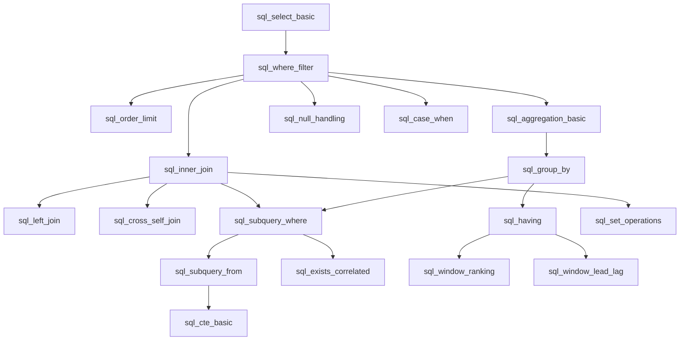

# Spec: Module `knowledge-graph`

> **Module ID:** `knowledge-graph`  
> **Trạng thái:** Bản thảo đề xuất (Draft Proposal for Review)  
> **Tài liệu cha:** [Capability Map](file:///home/diepvanhieu/workspace/adaptive-learning-sql/.onion/capability-map.md)  
> **Phiên bản:** 1.0.0

---

## 1. Objective (Mục Tiêu)

Xây dựng bản đồ tri thức chuẩn (Ontology & Directed Acyclic Graph - DAG) cho môn SQL/Database (~18 khái niệm cốt lõi) và chuẩn hóa cấu trúc dữ liệu cho ngân hàng bài tập thông minh. 

Module này là **nền móng dữ liệu (Ground Truth)** cho toàn bộ hệ thống:
- Môi trường giả lập `cognitive-simulator` sử dụng DAG để xác định lộ trình học hợp lệ và mô phỏng việc tích lũy kiến thức theo tiên quyết.
- `rl-engine` sử dụng danh sách concept và quan hệ tiên quyết để sinh Action Masking (ngăn gợi ý bài học vượt cấp khi chưa mở khóa tiên quyết).
- `sql-engine` sử dụng các quy tắc AST (`ast_rules`) gắn kèm mỗi bài tập để chấm điểm bản chất.
- `lms-backend` và `lms-frontend` sử dụng JSON Schema này để hiển thị Cây kỹ năng trực quan (`@xyflow/react`) và điều phối bài tập tương ứng với quyết định của RL Agent.

---

## 2. Commands (Lệnh Thực Thi Chuẩn)

```bash
# Cài đặt môi trường Backend & dependencies
cd backend && python3 -m venv .venv && source .venv/bin/activate
pip install -r requirements.txt

# Kiểm định tính toàn vẹn của Đồ thị Tri thức và Ngân hàng bài tập
pytest tests/test_knowledge_graph.py -v --durations=10

# Chạy kiểm tra tĩnh kiểu dữ liệu (Static Type Check)
mypy app/domain/kg --strict

# Linter và format code
ruff check app/domain/kg tests/test_knowledge_graph.py
ruff format app/domain/kg tests/test_knowledge_graph.py --check
```

---

## 3. Project Structure (Cấu Trúc Thư Mục Module)

```text
adaptive-learning-sql/
├── data/
│   ├── knowledge_graph.json         # Định nghĩa toàn bộ 18 concepts, quan hệ tiên quyết, độ sâu Bloom
│   └── exercises/                   # Ngân hàng bài tập mẫu (JSON theo concept)
│       ├── select_basic.json
│       ├── where_filter.json
│       ├── group_by_having.json
│       ├── inner_join.json
│       └── ...
└── backend/
    ├── app/
    │   └── domain/
    │       └── kg/
    │           ├── __init__.py
    │           ├── models.py        # Pydantic v2 schemas: Concept, PrerequisiteDAG, Exercise, ASTConstraint
    │           ├── validator.py     # DAG cycle detection (Tarjan/DFS), topological sort, orphan check
    │           └── loader.py        # Đọc và nạp dữ liệu từ thư mục data/ với validation chặt chẽ
    └── tests/
        └── test_knowledge_graph.py  # Unit tests cho DAG integrity & bài tập validation
```

---

## 4. Code Style & Conventions (Quy Chuẩn Code)

- Sử dụng **Python 3.11+**, tận dụng triệt để `pydantic >= 2.6` và strict type annotations (`typing`).
- Tất cả schema dữ liệu đều là `BaseModel` bất biến (`frozen=True`) để chống side-effects khi truyền giữa các module.
- Tên Concept ID theo quy ước `snake_case` viết hoa dạng enum hoặc hằng số rõ ràng: `sql_select_basic`, `sql_inner_join`, `sql_group_by`.

### Ví dụ mẫu triển khai chuẩn:

```python
from enum import Enum
from typing import List, Optional, Dict, Any
from pydantic import BaseModel, Field, model_validator


class DifficultyLevel(str, Enum):
    EASY = "EASY"
    MEDIUM = "MEDIUM"
    HARD = "HARD"


class PedagogicalMode(str, Enum):
    LEARN_NEW = "LEARN_NEW"
    PRACTICE_REVIEW = "PRACTICE_REVIEW"
    DIAGNOSTIC_QUIZ = "DIAGNOSTIC_QUIZ"


class ASTConstraint(BaseModel):
    required_clauses: List[str] = Field(default_factory=list, description="Các mệnh đề bắt buộc (e.g. ['GROUP BY', 'HAVING'])")
    forbidden_clauses: List[str] = Field(default_factory=list, description="Các mệnh đề bị cấm để chống gian lận/hardcode (e.g. ['WHERE'])")
    min_tables_joined: int = Field(default=0, description="Số lượng bảng tối thiểu phải JOIN")


class ProgressiveHints(BaseModel):
    concept_hint: str = Field(..., description="Gợi ý mức 1: Ý tưởng/Mệnh đề cần dùng")
    scaffold_hint: str = Field(..., description="Gợi ý mức 2: Khung câu lệnh điền chỗ trống")
    solution_explained: str = Field(..., description="Gợi ý mức 3: Lời giải chi tiết từng dòng")


class SpotCheckQuestion(BaseModel):
    id: str = Field(..., pattern=r"^spot_[a-z0-9_]+$")
    question: str = Field(..., description="Câu hỏi trắc nghiệm phản xạ 30s giải thích bản chất")
    options: List[str] = Field(..., min_length=2, max_length=4)
    correct_option_index: int = Field(..., ge=0)
    explanation: str


class DiagnosticQuestion(BaseModel):
    id: str = Field(..., pattern=r"^diag_[a-z0-9_]+$")
    target_concept_id: str
    prerequisite_chain: List[str] = Field(default_factory=list, description="Danh sách các node tiên quyết được suy diễn nếu trả lời đúng")
    question_text: str
    options: List[str] = Field(..., min_length=2, max_length=4)
    correct_option_index: int = Field(..., ge=0)
    explanation: str


class CalibrationQuestion(BaseModel):
    id: str = Field(..., pattern=r"^calib_[a-z0-9_]+$")
    target_profile: str = Field(..., description="BEGINNER, INTERMEDIATE, ADVANCED")
    time_limit_seconds: int = Field(default=30)
    question_text: str
    options: List[str] = Field(..., min_length=2, max_length=4)
    correct_option_index: int = Field(..., ge=0)
    hint_on_fail: str


class Exercise(BaseModel):
    id: str = Field(..., pattern=r"^ex_[a-z0-9_]+$")
    concept_id: str
    difficulty: DifficultyLevel
    mode: PedagogicalMode
    title: str
    description: str
    expected_columns: List[str] = Field(default_factory=list, description="Các cột kết quả để Client so sánh")
    expected_row_count: int = Field(default=0)
    schema_ddl: str = Field(..., description="Câu lệnh CREATE TABLE cho sandbox")
    seed_data_sql: str = Field(..., description="INSERT dữ liệu mẫu có bẫy NULL và dòng trùng lặp")
    solution_sql: str = Field(..., description="Câu truy vấn mẫu chuẩn mực")
    ast_constraint: ASTConstraint = Field(default_factory=ASTConstraint)
    hints: ProgressiveHints
    spot_check: SpotCheckQuestion


class SQLConcept(BaseModel):
    id: str = Field(..., pattern=r"^sql_[a-z0-9_]+$")
    name: str
    description: str
    prerequisites: List[str] = Field(default_factory=list)
    bloom_level: int = Field(ge=1, le=6, description="Thang đo Bloom: 1 (Nhớ) -> 6 (Sáng tạo/Tối ưu)")
    bkt_default_prior: float = Field(default=0.1, ge=0.0, le=1.0)
    ebbinghaus_strength_base: float = Field(default=2.0, gt=0.0)
```

---

## 5. Danh Sách 18 Concepts Cốt Lõi (Ontology & DAG)



---

## 6. Testing Strategy (Chiến Lược Kiểm Thử)

1. **DAG Cycle Detection Test:**
   - Dùng thuật toán DFS / Topological Sort để khẳng định: Đồ thị tri thức **hoàn toàn không có chu trình (No Cycles)**.
2. **Prerequisite Integrity Test:**
   - Mọi `prerequisite_id` khai báo trong từng concept bắt buộc phải tồn tại trong tập ID của đồ thị (Không có liên kết gãy / Broken References).
3. **Root Node Reachability:**
   - Tồn tại ít nhất 1 node gốc không có điều kiện tiên quyết (`sql_select_basic`).
   - Mọi node khác đều có đường đi dẫn về node gốc.
4. **Exercise Schema Validation:**
   - Tất cả các bài tập mẫu trong thư mục `data/exercises/` phải parse thành công vào model `Exercise`.
   - `schema_ddl` và `seed_data_sql` phải hợp lệ về mặt cú pháp SQLite (chạy thử in-memory để kiểm tra).
   - `solution_sql` khi chạy trên database mẫu phải sinh ra kết quả khớp hoàn toàn với `expected_output`.
   - Seed data bắt buộc chứa ít nhất 1 giá trị `NULL` hoặc dòng dữ liệu cạnh (Edge cases).

---

## 7. Boundaries (Ranh Giới Phát Triển)

- **Always (Luôn luôn làm):**
  - Chạy `pytest tests/test_knowledge_graph.py` trước khi commit bất kỳ thay đổi nào về dữ liệu bài tập hoặc đồ thị.
  - Sử dụng Pydantic models để validate tất cả file JSON tại thời điểm khởi động hệ thống.
  - Giữ concept ID ổn định, không tùy tiện đổi tên khi các module sau (`simulator`, `rl-engine`) đã tham chiếu.
- **Ask first (Cần hỏi trước khi làm):**
  - Thêm, bớt hoặc sửa quan hệ tiên quyết giữa các node trong đồ thị tri thức (vì sẽ ảnh hưởng đến không gian hành động của mô hình RL).
  - Thay đổi cấu trúc trường trong `Exercise` schema.
- **Never (Tuyệt đối không làm):**
  - Hardcode logic đồ thị vào file code Python (đồ thị phải đọc từ file cấu hình `knowledge_graph.json` để bảo đảm tính mở rộng Domain-Agnostic).
  - Cho phép chu trình phụ thuộc trong đồ thị ($A \to B \to A$).
  - Lưu bài tập không có test case hoặc không có gợi ý 3 cấp độ.

---

## 8. Success Criteria (Tiêu Chí Nghiệm Thu)

1. File `data/knowledge_graph.json` định nghĩa đủ 18 concepts cốt lõi, phản ánh trung thực phân cấp kỹ năng SQL từ cơ bản đến tối ưu hóa.
2. Bộ kiểm thử `tests/test_knowledge_graph.py` chạy qua 100% các test: Không chu trình, không orphan ID, schema hợp lệ.
3. Bộ bài tập mẫu có ít nhất 2 bài tập cho mỗi concept (tổng cộng $\ge 36$ bài tập mẫu chuẩn hóa), kiểm tra chạy thực tế được trên SQLite in-memory mà không phát sinh lỗi cú pháp.
4. Tốc độ nạp và validate toàn bộ đồ thị tri thức cùng 100 bài tập trên Python đạt $< 100$ms.

---

## 9. Open Questions (Câu Hỏi Mở)

1. Trong 18 concepts, có cần tách riêng `sql_recursive_cte` (CTE đệ quy) hay chỉ dừng ở `sql_cte_basic` để giữ tải vừa phải cho đối tượng sinh viên 15 tuần?
2. Bộ câu hỏi Spot-check 30s nên là trắc nghiệm 4 đáp án hay câu hỏi điền từ vào chỗ trống? (Khuyến nghị: Trắc nghiệm 3-4 đáp án với 1 bẫy nhận thức phổ biến để tối ưu thao tác nhanh trên mobile/web).
