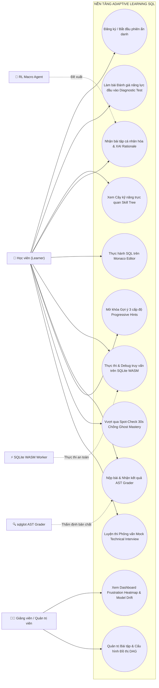
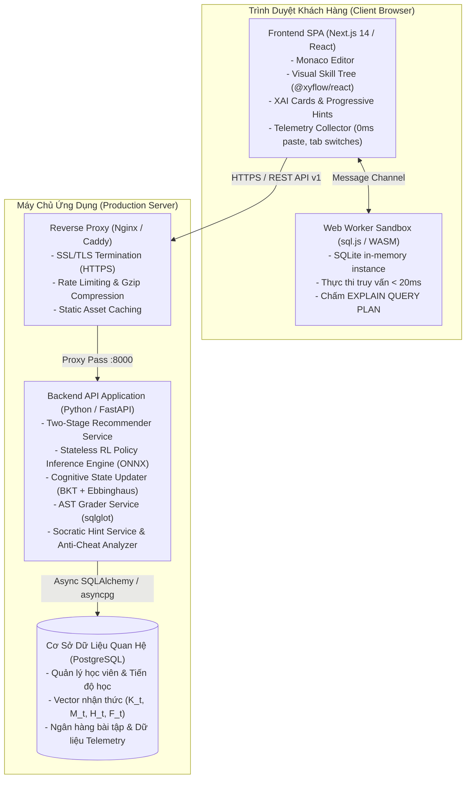
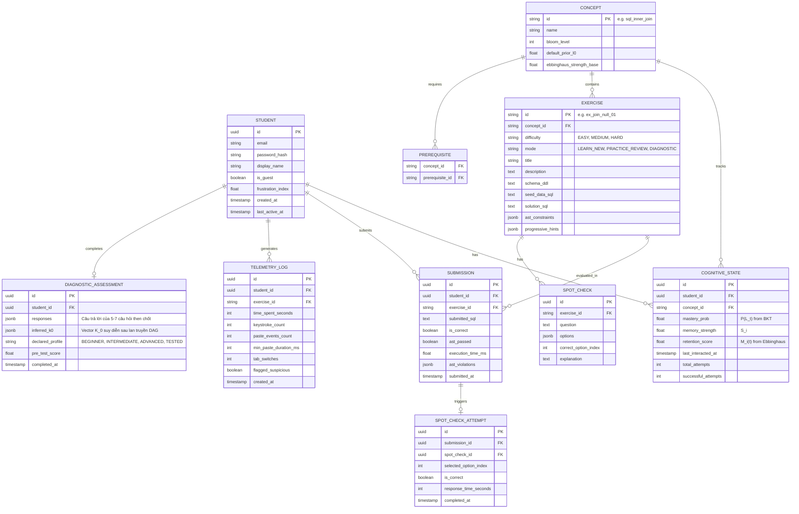
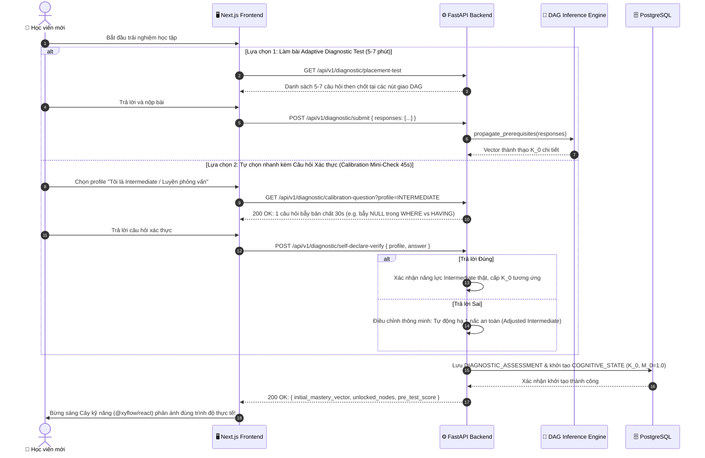
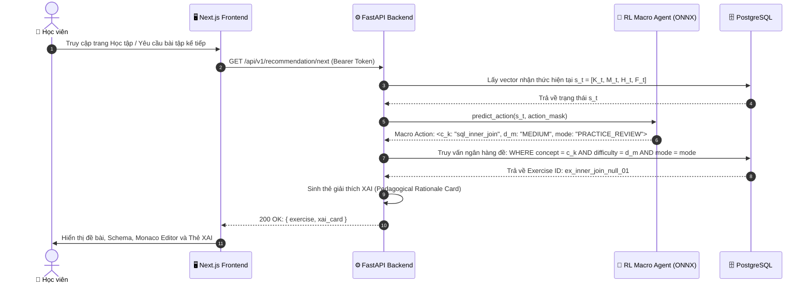
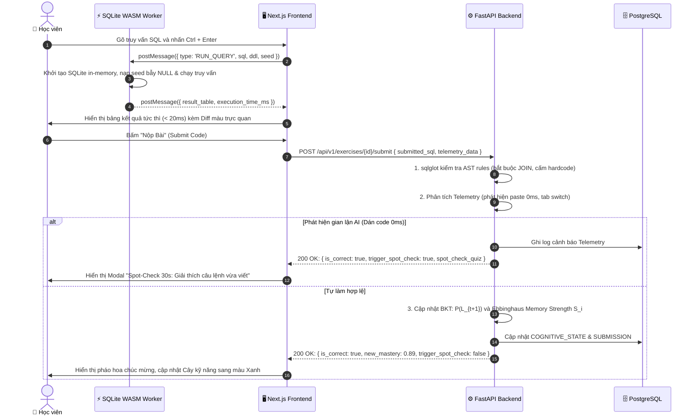
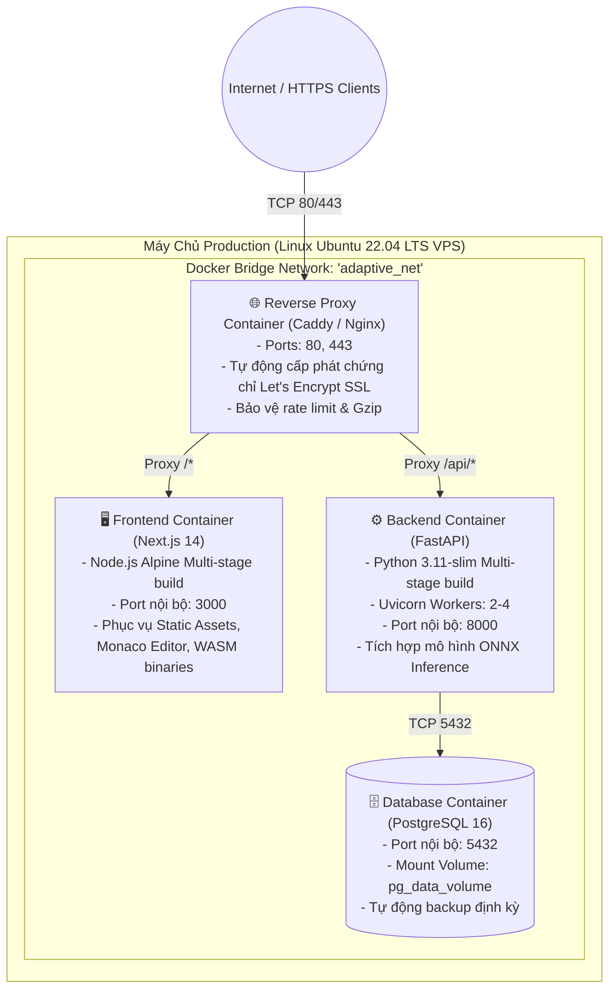
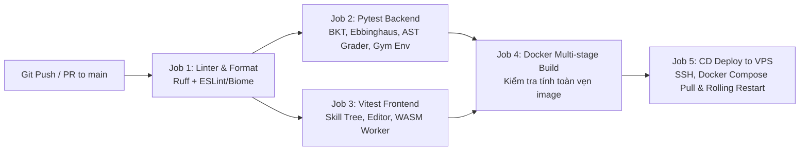

# Phân Tích Hệ Thống & Kiến Trúc Triển Khai Hạ Tầng (System Analysis & Infrastructure Architecture)

> **Dự án:** Hệ thống quản lý và khuyến nghị lộ trình học cá nhân hóa (Adaptive Learning) cho môn SQL/Database  
> **Sinh viên thực hiện:** Diệp Văn Hiệu (22115053122316) | **GVHD:** TS. Nguyễn Tấn Thuận  
> **Cơ sở đào tạo:** Khoa Công nghệ Số - Trường Đại học Sư phạm Kỹ thuật - Đại học Đà Nẵng  
> **Tài liệu tham chiếu:** [Phụ lục 02](file:///home/diepvanhieu/workspace/adaptive-learning-sql/PHU%20LUC%2002_De%20cuong%20DATN.md) | [Phụ lục 03](file:///home/diepvanhieu/workspace/adaptive-learning-sql/PHU%20LUC%2003_Nhiem%20vu%20do%20an.md) | [Capability Map](file:///home/diepvanhieu/workspace/adaptive-learning-sql/.onion/capability-map.md)

---

## 1. PHÂN TÍCH YÊU CẦU HỆ THỐNG (SYSTEM REQUIREMENTS ANALYSIS)

### 1.1. Các Tác Nhân Hệ Thống (Actors)

| Tác nhân | Phân loại | Trách nhiệm và Tương tác cốt lõi |
|---|---|---|
| **Learner (Học viên)** | Con người (Primary) | Người học SQL cấp độ Intermediate (luyện thi, phỏng vấn backend/data). Thực hiện bài đánh giá năng lực đầu vào (Diagnostic Placement Test), tương tác với Monaco Editor, chạy SQL trên SQLite WASM client-side, nhận khuyến nghị cá nhân hóa từ AI, xem Cây kỹ năng trực quan, tham gia Mock Technical Interview. |
| **Admin / Lecturer (Quản trị viên / Giảng viên)** | Con người (Secondary) | Quản lý ngân hàng bài tập và đề đánh giá đầu vào, cấu hình đồ thị tri thức DAG, theo dõi Dashboard giám sát 2 tầng: Kỹ thuật (độ trễ, lỗi sandbox) và Sư phạm (Bản đồ nhiệt nản lòng - Frustration Heatmap, Độ trôi mô hình - Model Drift). |
| **RL Macro Recommender** | Hệ thống (AI Agent) | Tác nhân học tăng cường đưa ra quyết định sư phạm tối ưu $a_t = \langle c_k, d_m, \text{mode} \rangle$ dựa trên quan sát trạng thái nhận thức hiện tại $s_t$ (khởi tạo từ bài Diagnostic Test). |
| **WASM In-Browser Sandbox** | Hệ thống (Client Engine) | Môi trường SQLite WebAssembly thực thi câu lệnh SQL trực tiếp trên RAM trình duyệt của học sinh với độ trễ < 20ms. Việc so sánh bảng kết quả (Diff table) diễn ra hoàn toàn ở Client. |
| **AST Semantic Grader** | Hệ thống (Rule Engine) | Bộ phân tích cú pháp trừu tượng (`sqlglot`) chạy trên Backend để kiểm tra cấu trúc câu lệnh khi sinh viên bấm Nộp Bài. |

---

### 1.2. Biểu Đồ Ca Sử Dụng Tổng Quát (Use Case Diagram)



---

## 2. THIẾT KẾ KIẾN TRÚC HỆ THỐNG (C4 MODEL)

### 2.1. C4 Level 1: Ngữ Cảnh Hệ Thống (System Context)

```mermaid
graph TD
    User["👤 Người học SQL<br/>(Sinh viên, Luyện phỏng vấn)"]
    Admin["👨‍🏫 Giảng viên / Quản trị viên"]
    
    System["📦 HỆ THỐNG ADAPTIVE LEARNING SQL<br/>- Nền tảng học thích ứng cá nhân hóa qua Two-Stage RL<br/>- Sandbox SQLite WASM client-side<br/>- Bộ chấm AST đa lớp & Giám sát sư phạm"]
    
    LLM_API["☁️ LLM Provider (Optional API)<br/>Hỗ trợ sinh giải thích Socratic sâu"]
    
    User -->|Học tập, gõ SQL, nộp bài, luyện phỏng vấn| System
    Admin -->|Theo dõi Frustration Heatmap, kiểm tra độ trôi AI| System
    System -.->|Gọi API gợi ý mở rộng (khi cần)| LLM_API
```

---

### 2.2. C4 Level 2: Kiến Trúc Vùng Chứa (Container Diagram)

Hệ thống được thiết kế theo mô hình Micro-Containerized Monolith tối ưu cho nhà phát triển độc lập (Solo Dev) triển khai trong 15 tuần:



---

## 3. THIẾT KẾ MÔ HÌNH DỮ LIỆU (DATABASE SCHEMA & ERD)

Toàn bộ dữ liệu hệ thống được lưu trữ trong PostgreSQL theo mô hình quan hệ chuẩn hóa:



---

## 4. BIỂU ĐỒ TUẦN TỰ NGHIỆP VỤ (SEQUENCE DIAGRAMS)

### 4.1. Luồng Đánh Giá Năng Lực Đầu Vào & Khởi Tạo Trạng Thái Nhận Thức $s_0$ (Onboarding Diagnostic & Calibration Loop)

Học viên mới có 2 lựa chọn linh hoạt để khởi tạo lộ trình:
- **Lựa chọn 1 (Khuyến nghị - 5-7 phút):** Làm bài Adaptive Placement Test (5-7 câu tại các nút giao DAG).
- **Lựa chọn 2 (Trải nghiệm nhanh - 45 giây):** Tự chọn trình độ (Beginner / Intermediate / Advanced) kèm **1 câu hỏi xác thực phản xạ (Calibration Mini-Check 30s)** để kiểm chứng, tránh ảo tưởng năng lực (Dunning-Kruger Effect) làm sai lệch vector $s_0$.



---

### 4.2. Luồng Khuyến Nghị Thích Ứng (Two-Stage Recommendation Loop)



---

### 4.3. Luồng Thực Thi, Chấm AST & Chống Gian Lận (Submission & Anti-Cheat)



---

## 5. THIẾT KẾ TRIỂN KHAI HẠ TẦNG (INFRASTRUCTURE & DEVOPS ARCHITECTURE)

### 5.1. Kiến Trúc Triển Khai Production (Deployment Topology)



---

### 5.2. Cấu Hình Docker Compose Chuẩn Mực (`docker-compose.prod.yml`)

```yaml
version: '3.8'

networks:
  adaptive_net:
    driver: bridge

volumes:
  pg_data:
    driver: local
  caddy_data:
    driver: local
  caddy_config:
    driver: local

services:
  postgres:
    image: postgres:16-alpine
    container_name: adaptive_postgres
    restart: always
    environment:
      POSTGRES_USER: ${DB_USER:-postgres}
      POSTGRES_PASSWORD: ${DB_PASSWORD:-secure_db_pass_2026}
      POSTGRES_DB: ${DB_NAME:-adaptive_sql}
    volumes:
      - pg_data:/var/lib/postgresql/data
      - ./backend/scripts/init_db.sql:/docker-entrypoint-initdb.d/init.sql
    networks:
      - adaptive_net
    healthcheck:
      test: ["CMD-SHELL", "pg_isready -U ${DB_USER:-postgres}"]
      interval: 10s
      timeout: 5s
      retries: 5

  backend:
    build:
      context: ./backend
      dockerfile: Dockerfile.prod
    container_name: adaptive_backend
    restart: always
    environment:
      DATABASE_URL: postgresql+asyncpg://${DB_USER:-postgres}:${DB_PASSWORD:-secure_db_pass_2026}@postgres:5432/${DB_NAME:-adaptive_sql}
      SECRET_KEY: ${SECRET_KEY}
      ENVIRONMENT: production
      INFERENCE_MODEL_PATH: /app/models/rl_policy_ppo.onnx
    depends_on:
      postgres:
        condition: service_healthy
    networks:
      - adaptive_net
    healthcheck:
      test: ["CMD", "curl", "-f", "http://localhost:8000/api/v1/health"]
      interval: 15s
      timeout: 5s
      retries: 3

  frontend:
    build:
      context: ./frontend
      dockerfile: Dockerfile.prod
    container_name: adaptive_frontend
    restart: always
    environment:
      NEXT_PUBLIC_API_URL: https://${DOMAIN_NAME:-adaptive-sql.edu.vn}/api/v1
    networks:
      - adaptive_net

  caddy:
    image: caddy:2-alpine
    container_name: adaptive_caddy
    restart: always
    ports:
      - "80:80"
      - "443:443"
    volumes:
      - ./Caddyfile:/etc/caddy/Caddyfile
      - caddy_data:/data
      - caddy_config:/config
    depends_on:
      - backend
      - frontend
    networks:
      - adaptive_net
```

---

### 5.3. Quy Trình CI/CD Tự Động Hóa (GitHub Actions Pipeline)

Được thiết kế theo chuẩn `/onion-agents:ci-cd-and-automation` đảm bảo chất lượng code trước khi deploy:



* **Trọng tâm kiểm soát chất lượng (Quality Gates):**
  1. `ruff check backend/` & `mypy backend/` không có lỗi tĩnh.
  2. Toàn bộ test suite unit & integration đạt độ phủ $\ge 80\%$.
  3. Gymnasium `check_env(SQLStudentEnv)` vượt qua không có warning.
  4. Docker build hoàn thành trong thời gian $< 5$ phút.

---

### 5.4. Trung Tâm Giám Sát Vận Hành & Sư Phạm (Observability & Health Monitoring)

Hệ thống cung cấp Endpoint giám sát tiêu chuẩn phục vụ cho việc đánh giá bảo vệ đồ án:

1. **Endpoint Kiểm tra Sức khỏe Kỹ thuật (`GET /api/v1/health`):**
   ```json
   {
     "status": "HEALTHY",
     "timestamp": "2026-10-15T08:30:00Z",
     "checks": {
       "database_connection": "OK",
       "rl_inference_engine": "OK (latency: 14ms)",
       "memory_usage_mb": 142.5
     }
   }
   ```
2. **Dashboard Giám sát Sư phạm (Pedagogical Telemetry):**
   - **Bản đồ nhiệt nản lòng (Frustration Heatmap):** Tự động phát hiện các câu truy vấn có tỷ lệ học viên thử lại $\ge 3$ lần vượt quá ngưỡng 35% để thông báo cho Giảng viên can thiệp.
   - **Bộ đối soát độ trôi mô hình (Model Drift Analyzer):** Đo độ lệch chuẩn $MAE = \frac{1}{M}\sum |P(\text{Correct})_{\text{predicted}} - \text{ActualResult}|$ để khẳng định tính chính xác của mô hình BKT theo thời gian thực.

---

## 6. PHÂN TÍCH ĐỘ CHỊU TẢI, QUẢN LÝ PHIÊN & TỐI ƯU HÓA NGHIỆP VỤ (SCALABILITY, SESSION & UX AUDIT)

### 6.1. Phân Tích Độ Chịu Tải & Khả Năng Mở Rộng (Scalability & Concurrency)

#### 1. Nguyên lý Thiết kế Giảm Tải Đột Phá: Client-Side Sandbox
- Không giống các hệ thống truyền thống chạy code trên Server bằng Docker hoặc RDBMS container (sẽ sập khi có 50-100 người chạy đồng thời), toàn bộ việc thực thi và debug truy vấn SQL diễn ra **100% trên WebAssembly SQLite (`sql.js`) trong Web Worker của trình duyệt người học**.
- Server FastAPI hoàn toàn không chịu áp lực tính toán từ việc chạy code SQL của học viên.

#### 2. Định Mức Chịu Tải Mục Tiêu (Target Benchmarks trên VPS 2 vCPU, 4GB RAM):
- **Số người học hoạt động đồng thời (Concurrent Active Learners):** **500 - 1.000 người dùng** cùng thao tác, gõ code, chạy truy vấn in-memory và nhận gợi ý mà không gây nghẽn Server.
- **Tải đỉnh tại Backend (Peak Throughput):** Đạt **150 - 200 requests/giây (RPS)** cho các tác vụ suy luận RL và nộp bài kiểm tra AST.
- **Thời gian phản hồi mục tiêu (Latency Budgets - p95):**
  - Chạy thử SQL trên trình duyệt: $< 20$ ms (Zero server latency).
  - Suy luận mô hình RL Macro Agent (ONNX): $< 20$ ms.
  - Phân tích cú pháp AST (`sqlglot`): $< 10$ ms.
  - Phản hồi API tổng thể: $< 80$ ms.

---

### 6.2. Chiến Lược Lưu Trữ & Quản Lý Phiên Học Viên (Session & Data Persistence)

Hệ thống triển khai mô hình lưu trữ **3 tầng (3-Tier Storage Model)**:

1. **Tầng Trình Duyệt (Client Storage):**
   - `LocalStorage`: Lưu JWT Session token, thiết lập giao diện (theme, cỡ chữ, bố cục panel), và **tự động lưu nháp code (Auto-save draft)** mỗi 2 giây (`draft_{exercise_id}`) để không bao giờ mất code dở dang khi reload trang.
   - `Web Worker RAM`: Lưu trữ SQLite in-memory instance của bài tập hiện tại. Dữ liệu được cấp phát và giải phóng ngay khi đổi bài (Zero memory leak).

2. **Tầng Bộ Đệm Máy Chủ (Server Cache Layer):**
   - Đồ thị tri thức DAG và ngân hàng bài tập (metadata, DDL, seed, AST rules) được nạp sẵn vào RAM khi khởi động ứng dụng (In-memory Cache), triệt tiêu việc query lặp lại nhiều lần vào CSDL.

3. **Tầng CSDL Bền Vững (PostgreSQL Persistent Storage):**
   - Lưu trữ thông tin sinh viên, lịch sử nộp bài (`submissions`), vector nhận thức ($K_t, M_t, S_i$), nhật ký gõ phím / dán code (`telemetry_logs`), và kết quả bài đánh giá đầu vào (`diagnostic_assessments`).
   - **Cơ chế Guest Session sang Registered:** Người dùng mới vào học ngay dưới phiên ẩn danh (`is_guest = true`). Khi đăng ký tài khoản chính thức, hệ thống chuyển cờ `is_guest = false` và liên kết email, bảo lưu 100% tiến độ và Cây kỹ năng đã học.

---

### 6.3. Ma Trận Tối Ưu Hóa Nghiệp Vụ & Trải Nghiệm Người Dùng (Zero-Friction UX)

| Giai đoạn | Rủi ro gây nản lòng (Friction) | Cơ chế Tối ưu hóa Triệt để (Zero-Friction Solution) |
|---|---|---|
| **Onboarding** | Bắt đăng ký rườm rà, bài kiểm tra đầu vào quá dài hoặc tự khai báo sai lệch (ảo tưởng năng lực Dunning-Kruger). | 1-chạm vào học ngay với Guest Session. Hai lựa chọn: (A) Bài đánh giá thích ứng nhanh 5 phút (5-7 câu then chốt trên DAG); (B) Tự chọn profile kèm **1 câu hỏi xác thực phản xạ (Calibration Mini-Check 30s)** để hiệu chỉnh vector $s_0$ chính xác, tránh ngợp bài. |
| **Workspace** | Phải chuyển tab xem schema, chạy truy vấn lâu, mất code. | Giao diện 3 cột tương tác: Click tên cột tự chèn code; phím tắt `Ctrl + Enter` chạy tức thì (< 20ms); tự động lưu nháp code. |
| **Báo lỗi SQL** | Thông báo lỗi SQLite tiếng Anh khô khan, trừu tượng. | Bộ biên dịch lỗi thân thiện (Friendly Error Explainer): Dịch sang tiếng Việt, chỉ rõ dòng/cột sai và gợi ý hướng sửa. |
| **Khi bế tắc** | Không biết làm tiếp, bỏ cuộc hoặc mở ChatGPT ngoài. | Gợi ý 3 cấp độ (Progressive Hints): Gợi ý khái niệm $\to$ Khung điền chỗ trống $\to$ Lời giải chi tiết từng dòng. |
| **Chống gian lận** | Cảnh báo giả làm phiền học sinh tự làm chân chính. | Spot-Check 30s chỉ kích hoạt khi Telemetry phát hiện dán code $\ge 50$ ký tự trong $< 100$ms kèm chuyển tab. |
| **Chống quên** | Quên kiến thức cũ sau thời gian dài mà không hay biết. | Đường cong Ebbinghaus tự động cảnh báo khi độ ghi nhớ $< 50\%$, Cây kỹ năng đổi màu và RL xen kẽ bài ôn tập ngắt quãng. |
