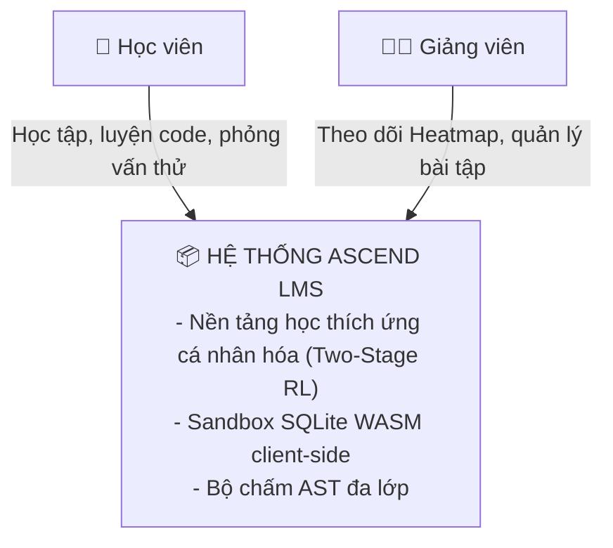
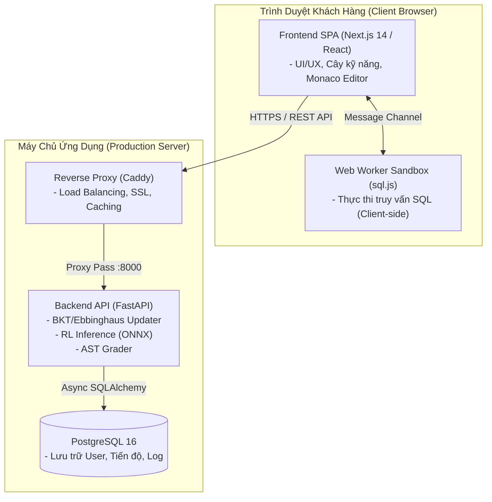
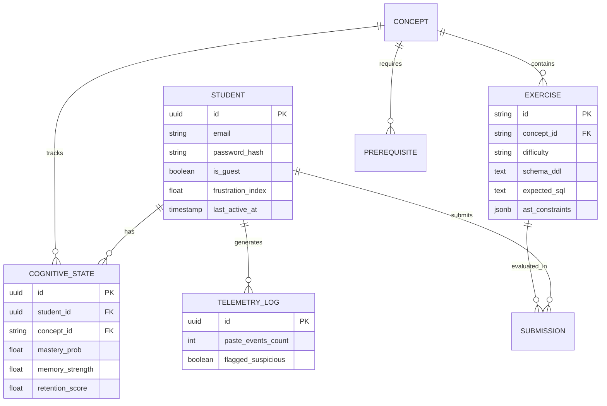
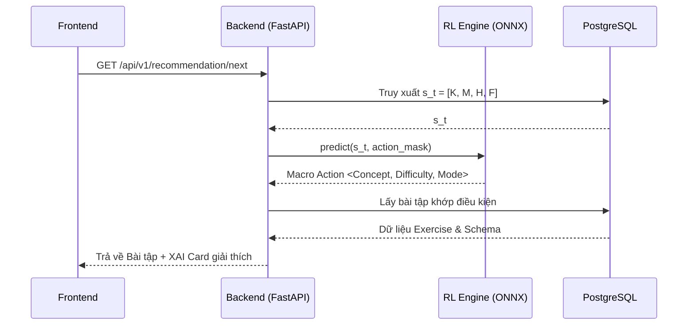
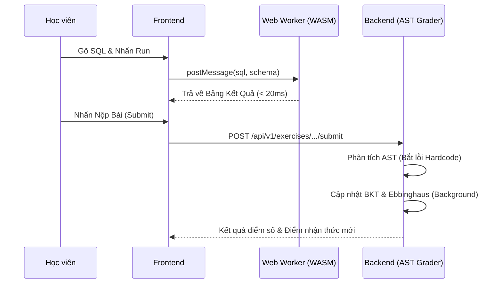

# High-Level Design (HLD): Hệ thống Ascend LMS - "Rise above limits"

> **Mục đích:** Tài liệu thiết kế tổng thể hệ thống, cung cấp cái nhìn vĩ mô về kiến trúc phần mềm, mô hình dữ liệu, cơ sở hạ tầng và các luồng tương tác chính. Phục vụ trực tiếp cho quá trình báo cáo Đồ án tốt nghiệp.
> **Dự án:** Hệ thống quản lý và khuyến nghị lộ trình học cá nhân hóa cho môn SQL/Database.

---

## 1. Tổng Quan Kiến Trúc (Architecture Overview)

Hệ thống được thiết kế theo mô hình **Micro-Containerized Monolith**, tận dụng sự phân tách rõ ràng giữa Frontend (Client-side WASM) và Backend (API & AI Inference), giúp tối ưu hóa chi phí vận hành cho 1 nhà phát triển nhưng vẫn chịu tải được lượng truy cập lớn (500 - 1000 CCU).

### 1.1. Sơ Đồ Ngữ Cảnh (C4 Model - Level 1)

Hệ thống tương tác với 2 nhóm người dùng chính:
1. **Học viên:** Tương tác với không gian học SQL, nhận khuyến nghị cá nhân hóa, và thực thi truy vấn trực tiếp trên trình duyệt.
2. **Giảng viên / Admin:** Quản trị ngân hàng bài tập, theo dõi bản đồ nhiệt (Frustration Heatmap) và giám sát mô hình.

### 1.2. Sơ Đồ Container (C4 Model - Level 2)

---

## 2. Kiến Trúc Dữ Liệu (Data Architecture)

Mô hình dữ liệu quan hệ (ERD) được thiết kế tập trung vào việc lưu vết lịch sử học tập (Telemetry) và trạng thái nhận thức (Cognitive State) của học viên.

---

## 3. Luồng Nghiệp Vụ Cốt Lõi (Core Sequence Flows)

### 3.1. Luồng Khuyến Nghị Bài Tập (Recommendation Flow)
Sử dụng kiến trúc Two-Stage Recommendation:
1. **Macro Action:** Mô hình RL lấy vector nhận thức $s_t$ và quyết định chiến lược vĩ mô (Concept + Độ khó + Chế độ).
2. **Micro Action:** Database truy xuất bài tập cụ thể khớp với chiến lược vĩ mô.

### 3.2. Luồng Thực Thi & Chấm Điểm
Giảm tải tối đa cho Server bằng cách chạy SQL ngay trên trình duyệt (WASM).

---

## 4. Kiến Trúc Hạ Tầng & Triển Khai (Infrastructure Topology)

- **Công cụ Container:** Docker & Docker Compose.
- **Web Server / Proxy:** Caddy v2 (Tự động cấp phát chứng chỉ Let's Encrypt SSL, quản lý rate limit).
- **Backend:** Python 3.11 (FastAPI, Uvicorn, ONNX Runtime).
- **Frontend:** Node.js (Next.js 14 App Router, chạy chế độ Standalone).
- **Database:** PostgreSQL 16 (Volume persistence).
- **CI/CD:** GitHub Actions (Linting -> Testing -> Docker Build -> SSH Deploy).

Mô hình triển khai này đảm bảo hệ thống có thể self-host dễ dàng trên 1 VPS 2-core / 4GB RAM mà vẫn phục vụ mượt mà hàng trăm học viên cùng lúc nhờ khả năng offload quá trình chạy code xuống client-side WASM.
