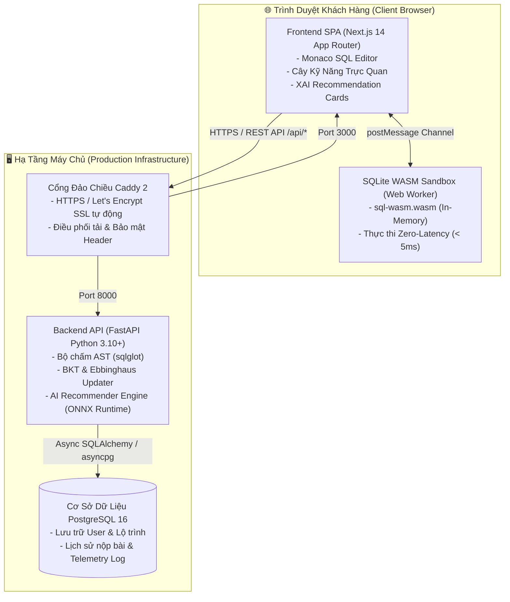

<div align="center">

# 🚀 Ascend LMS — "Rise Above Limits"

**Nền Tảng Quản Lý & Khuyến Nghị Lộ Trình Học Tập Thích Ứng (Adaptive Learning) Cho Môn SQL**  
*Ứng dụng Mô hình Học Tăng Cường (Reinforcement Learning) & Môi trường Thực thi WASM Zero-Latency*

[-success?style=for-the-badge&logo=githubactions)](.github/workflows/ci.yml)
[](docker-compose.yml)
[-black?style=for-the-badge&logo=next.js)](frontend/)
[](backend/)
[](frontend/public/)
[](LICENSE)

[Tổng Quan](#-tổng-quan-dự-án) • [Tính Năng Nổi Bật](#-tính-năng-nổi-bật) • [Kiến Trúc Hệ Thống](#-kiến-trúc-hệ-thống) • [Công Nghệ Sử Dụng](#-công-nghệ-sử-dụng) • [Khởi Chạy Nhanh](#-hướng-dẫn-khởi-chạy-quickstart) • [Cấu Trúc Dự Án](#-cấu-trúc-thư-mục-monorepo) • [Kế Hoạch Phát Triển](#-kế-hoạch-phát-triển-roadmap)

---

</div>

## 📌 Tổng Quan Dự Án

**Ascend LMS** là hệ thống học tập cá nhân hóa thông minh chuyên sâu cho môn Cơ sở dữ liệu và Truy vấn SQL. Dự án được nghiên cứu và phát triển theo định hướng **Đồ án Tốt nghiệp Xuất sắc**: kết hợp chặt chẽ giữa **Nền tảng Toán học/AI vững chắc**, **Sản phẩm Web LMS thực tế có thể mở rộng** và **Trải nghiệm người dùng Zero-Friction**.

Khác biệt hoàn toàn với các nền tảng học truyền thống (lộ trình cố định, phản hồi chậm, dễ bị gian lận bởi GenAI), Ascend LMS giải quyết triệt để 3 bài toán:
1. **Lộ trình cá nhân hóa động theo từng học viên:** Kết hợp mô hình nhận thức người học (**Bayesian Knowledge Tracing - BKT**) và **Đường cong quên lãng Ebbinghaus** với mô hình **Học tăng cường (Reinforcement Learning - MaskablePPO)** để tự động đề xuất bài học, bài tập và phiên ôn tập ngắt quãng (Spaced Repetition) tối ưu.
2. **Thực thi SQL tức thời không tốn tài nguyên máy chủ:** Tận dụng công nghệ **SQLite WASM Web Worker** ngay trên trình duyệt client, giảm độ trễ thực thi xuống **< 50ms** (thực tế ~1ms), chịu tải hàng nghìn người dùng đồng thời mà không tạo gánh nặng máy chủ tính toán.
3. **Phòng vệ chống gian lận trong kỷ nguyên GenAI:** Tích hợp bộ chấm ngữ nghĩa **Abstract Syntax Tree (AST)** bằng `sqlglot` (chặn hardcode, bắt buộc dùng chỉ mục Index/JOIN hợp lệ) cùng cơ chế giám sát **Telemetry 0ms Paste & Spot-Check Calibration**.

---

## ✨ Tính Năng Nổi Bật

### 1. ⚡ Sandbox SQL In-Memory Client-Side (SQLite WASM)
- Toàn bộ cơ sở dữ liệu mẫu, schema DDL và câu truy vấn SQL của học viên được thực thi biệt lập trong **Web Worker** luồng phụ của trình duyệt thông qua nhị phân `sql-wasm.wasm`.
- **Độ trễ siêu tốc:** Kết quả trả về trong **0.1ms - 5ms**, không gây giật lag giao diện chính (Zero UI Blocking).
- **An toàn tuyệt đối:** Học viên có thể chạy các câu lệnh can thiệp dữ liệu (`DROP TABLE`, `DELETE`, `UPDATE`) mà không sợ ảnh hưởng hệ thống — làm mới trang (F5) sẽ tự động hoàn nguyên cơ sở dữ liệu.

### 2. 🧠 Khuyến Nghị Hai Tầng (Two-Stage RL Recommender)
- **Tầng vĩ mô (Macro Action):** Mô hình RL (`MaskablePPO` xuất xưởng dạng **ONNX**) quan sát vector nhận thức 41 chiều của học viên để quyết định hành động chiến lược: `<Khái niệm, Độ khó, Chế độ>`.
- **Tầng vi mô (Micro Action):** Hệ thống lọc cơ sở dữ liệu để tìm ra bài tập cụ thể đáp ứng chính xác chiến lược vĩ mô.
- **Trí tuệ nhân tạo có thể giải thích (Explainable AI - XAI):** Mỗi bài tập đi kèm thẻ lý giải rõ ràng tại sao hệ thống lại chọn bài tập này (vd: *Củng cố kiến thức trước khi bị quên*, *Thử thách mở khóa nút mới trên DAG*).

### 3. 🌳 Đồ Thị Tri Thức & Cây Kỹ Năng Trực Quan (Knowledge Graph DAG)
- Toàn bộ kiến thức SQL được mô hình hóa thành một **Đồ thị có hướng không chu trình (DAG)** gồm 18 khái niệm cốt lõi (từ `SELECT`, `WHERE`, `JOIN` đến `Window Functions` và `Indexing Optimizer`).
- Giao diện Cây Kỹ Năng tương tác trực quan, tự động đổi màu theo mức độ thành thạo thực tế của học viên.

### 4. 🛡️ Chấm Điểm Ngữ Nghĩa AST & Phòng Chống Gian Lận Đa Tầng
- **Phân tích AST:** Dùng `sqlglot` bóc tách cây ngữ pháp, ngăn chặn gian lận "hardcode" kết quả (ví dụ: dùng `SELECT 'An', 95` thay vì truy vấn bảng).
- **Phân tích kế hoạch thực thi:** Tự động đối chiếu kết quả `EXPLAIN QUERY PLAN` để bảo đảm học viên vận dụng đúng chỉ mục (Index Seek/Scan) thay vì quét toàn bộ bảng.
- **Telemetry Anti-Cheat:** Giám sát sự kiện dán code nhanh bất thường (Paste 0ms) và tần suất chuyển tab. Tự động kích hoạt câu hỏi kiểm chứng ngắn (Spot-Check) 30 giây để xác thực học viên thực sự hiểu code.

---

## 🏗️ Kiến Trúc Hệ Thống

Dự án tuân thủ mô hình **Micro-Containerized Architecture**, tối ưu hóa việc phân tách giữa giao diện khách hàng, cổng định tuyến, dịch vụ AI Backend và cơ sở dữ liệu.



---

## 💻 Công Nghệ Sử Dụng

| Thành phần | Công nghệ chính | Vai trò / Lý do lựa chọn |
|---|---|---|
| **Frontend** | **Next.js 14**, React 18, TypeScript | App Router hiện đại, SSR/SSG tối ưu SEO và tốc độ tải trang ban đầu. |
| **SQL Editor** | **Monaco Editor** (`@monaco-editor/react`) | Trình soạn thảo chuẩn VS Code, hỗ trợ autocomplete từ khóa SQL và phím tắt `Ctrl + Enter`. |
| **Client Database**| **sql.js** (SQLite WebAssembly) | Thực thi SQL in-memory trực tiếp trong Web Worker, offload 100% chi phí compute khỏi server. |
| **Styling** | **Tailwind CSS**, PostCSS, Lucide Icons | Thiết kế Dark Mode hiện đại, nhất quán, tinh gọn và tối ưu kích thước bundle. |
| **Backend API** | **FastAPI** (Python 3.10+), Uvicorn | Hiệu năng cao (Asynchronous), tự động sinh tài liệu OpenAPI / Swagger chuẩn chỉnh. |
| **AI / ML** | **Gymnasium**, `sb3-contrib` (MaskablePPO), **ONNX Runtime** | Mô phỏng học viên qua BKT + Ebbinghaus; chạy suy luận khuyến nghị siêu nhẹ (< 15ms) không cần PyTorch trên server. |
| **SQL Parser** | **sqlglot** | Phân tích Abstract Syntax Tree (AST), phát hiện gian lận và tối ưu câu truy vấn. |
| **Database** | **PostgreSQL 16**, SQLAlchemy (asyncpg), Alembic | Hệ quản trị cơ sở dữ liệu quan hệ mạnh mẽ, ACID, hỗ trợ JSONB cho dữ liệu telemetry. |
| **Reverse Proxy** | **Caddy 2** | Reverse proxy hiện đại, tự động hóa SSL, cấu hình tinh gọn thay thế Nginx. |
| **DevOps & CI/CD** | **Docker Compose**, **GitHub Actions**, Husky | Đóng gói toàn diện container 1 lệnh; quy trình kiểm thử 5 cổng nghiêm ngặt. |

---

## 🚀 Hướng Dẫn Khởi Chạy (Quickstart)

### Yêu Cầu Tiên Quyết
- [Docker](https://docs.docker.com/get-docker/) & [Docker Compose](https://docs.docker.com/compose/) (khuyến nghị Docker Desktop).
- [Node.js](https://nodejs.org/) v20+ (nếu muốn chạy thủ công trên máy host).
- [Python](https://www.python.org/) 3.10+ (nếu muốn phát triển backend cục bộ).

---

### Cách 1: Khởi Chạy Tự Động Toàn Diện Bằng Docker Compose (Khuyên dùng)

Chỉ với một câu lệnh duy nhất, toàn bộ 4 dịch vụ (PostgreSQL, FastAPI Backend, Next.js Frontend, Caddy Proxy) sẽ được tự động khởi dựng:

```bash
# 1. Sao chép biến môi trường mẫu
cp .env.example .env

# 2. Khởi chạy toàn bộ hệ thống bằng Docker Compose
docker compose up -d --build
```

Sau khi các container ở trạng thái `healthy`, bạn có thể truy cập các cổng sau:

| Dịch vụ | Địa chỉ truy cập | Ghi chú |
|---|---|---|
| **Cổng Web Tổng Hợp (Caddy Proxy)** | [http://localhost](http://localhost) | Cổng chuẩn cổng 80, tự động định tuyến `/api/*` về backend |
| **Sandbox Thử Nghiệm SQLite WASM** | [http://localhost/poc/sqlite](http://localhost/poc/sqlite) | Trải nghiệm Monaco Editor & Web Worker SQL Client-side |
| **Next.js Frontend (Trực tiếp)** | [http://localhost:3000](http://localhost:3000) | Cổng trực tiếp của Next.js |
| **Tài liệu API Backend (Swagger UI)** | [http://localhost/docs](http://localhost/docs) | Swagger tương tác API FastAPI |
| **FastAPI Backend (Trực tiếp)** | [http://localhost:8000/docs](http://localhost:8000/docs) | Kiểm tra sức khỏe `/api/v1/health` |

Để dừng toàn bộ dịch vụ:
```bash
docker compose down
```

---

### Cách 2: Chạy Thủ Công Môi Trường Phát Triển Cục Bộ (Local Dev)

#### 1. Khởi chạy Backend (FastAPI):
```bash
cd backend
python -m venv venv
source venv/bin/activate  # Trên Windows: venv\Scripts\activate
pip install -r requirements.txt
uvicorn app.main:app --reload --port 8000
```

#### 2. Khởi chạy Frontend (Next.js):
```bash
cd frontend
npm install
npm run dev
```

---

## 📁 Cấu Trúc Thư Mục (Monorepo)

```text
ascend-lms/
├── .github/
│   └── workflows/
│       └── ci.yml                 # CI Pipeline 5 cổng kiểm định tự động
├── .husky/                        # Git hooks (chạy linter tự động trước khi commit)
├── .onion/                        # Hồ sơ đặc tả kỹ thuật, phân tích toán học & kiến trúc
│   ├── API-CONTRACTS.md           # Hợp đồng API giữa Frontend và Backend
│   ├── SPEC-lms-frontend.md       # Đặc tả giao diện & Web Worker
│   ├── SPEC-lms-backend.md        # Đặc tả nghiệp vụ API & Database
│   ├── SPEC-sql-engine.md         # Đặc tả bộ chấm điểm AST & Sandbox
│   └── SYSTEM-ANALYSIS-ARCHITECTURE.md
├── backend/                       # Dịch vụ Backend FastAPI
│   ├── app/
│   │   ├── core/                  # Cấu hình, bảo mật, biến môi trường
│   │   └── main.py                # Điểm khởi đầu ứng dụng FastAPI
│   ├── tests/                     # Bộ kiểm thử Pytest
│   ├── Dockerfile                 # Dockerfile cho backend
│   └── pyproject.toml             # Cấu hình linter Ruff & Pytest
├── frontend/                      # Ứng dụng Next.js 14 Frontend
│   ├── public/
│   │   ├── sql-wasm.js            # Emscripten loader cho SQLite WASM
│   │   ├── sql-wasm.wasm          # Nhị phân nhúng SQLite WebAssembly
│   │   └── sqlite.worker.js       # Web Worker thực thi SQL độc lập
│   ├── src/
│   │   ├── app/
│   │   │   ├── poc/sqlite/        # Trang thử nghiệm SQLite WASM Sandbox
│   │   │   ├── globals.css        # Cấu hình Tailwind CSS
│   │   │   └── page.tsx           # Trang chủ
│   │   ├── components/
│   │   │   └── editor/            # Monaco SQL Editor component
│   │   └── hooks/
│   │       └── useSQLiteWorker.ts # React Hook kết nối Web Worker
│   ├── Dockerfile                 # Dockerfile Next.js tối ưu Standalone
│   └── package.json               # Dependencies phía client
├── tasks/
│   ├── plan.md                    # Bản kế hoạch phân rã 6 giai đoạn
│   └── todo.md                    # Bảng Kanban theo dõi tiến độ chi tiết
├── Caddyfile                      # Cấu hình Reverse Proxy Caddy 2
├── CONSTRAINTS.md                 # Tuyên ngôn cam kết chất lượng mã nguồn
├── docker-compose.yml             # Bộ điều phối container cục bộ
├── HLD.md                         # Tài liệu Thiết Kế Mức Cao (High-Level Design)
├── LLD.md                         # Tài liệu Thiết Kế Mức Chi Tiết (Low-Level Design)
└── README.md                      # Tài liệu giới thiệu dự án
```

---

## 🧪 Quy Chuẩn Kiểm Định & Chất Lượng (Quality Gates)

Dự án áp dụng quy chuẩn kỹ thuật nghiêm ngặt theo tài liệu [`CONSTRAINTS.md`](CONSTRAINTS.md). Mọi Pull Request muốn được hợp nhất vào nhánh `main` đều phải vượt qua **5 Cổng Chất Lượng Tự Động (GitHub Actions)**:

1. **Gate 1: Lint & Code Formatting**
   - Backend: `ruff check app/ tests/` & `ruff format --check`
   - Frontend: `npm run lint` (ESLint)
2. **Gate 2: Type Checking**
   - Backend: `mypy app/` (Strict mode)
   - Frontend: `tsc --noEmit` (TypeScript 0 error)
3. **Gate 3: Automated Unit Testing**
   - Backend: `pytest --cov=app --cov-fail-under=80`
   - Frontend: `vitest --run` (SQLite Web Worker benchmark < 50ms)
4. **Gate 4: Container Build Test**
   - Kiểm tra khả năng build độc lập của Dockerfile backend và frontend
5. **Gate 5: Security & Constraint Verification**
   - Quét cấm các cú pháp hạ thấp chuẩn chất lượng: không chấp nhận `@ts-ignore`, cấm bỏ qua linter trái phép.

---

## 🗺️ Kế Hoạch Phát Triển (Roadmap)

- [x] **Giai đoạn 1: Triệt tiêu Rủi ro Kỹ thuật & Hạ tầng**
  - [x] Khởi tạo Monorepo, cấu hình Git Workflow, Husky & lint-staged.
  - [x] Thiết lập Docker Compose 4 containers (Caddy, NextJS, FastAPI, Postgres).
  - [x] Thiết lập CI/CD GitHub Actions 5 cổng kiểm định tự động.
  - [x] Triển khai thành công PoC SQLite WASM Web Worker (`< 50ms` latency).
- [ ] **Giai đoạn 2: Cơ Sở Dữ Liệu & Bộ Chấm Ngữ Nghĩa AST**
  - [ ] Thiết kế ERD hoàn chỉnh và migration bằng Alembic.
  - [ ] Xây dựng bộ chấm `sqlglot` phát hiện gian lận và tối ưu Index qua `EXPLAIN QUERY PLAN`.
- [ ] **Giai đoạn 3: Môi Trường Mô Phỏng Nhận Thức & Huấn Luyện AI**
  - [ ] Triển khai công thức toán BKT và suy giảm trí nhớ Ebbinghaus.
  - [ ] Xây dựng môi trường `gymnasium.Env` và huấn luyện thuật toán `MaskablePPO`.
  - [ ] Xuất xưởng mô hình định dạng ONNX phục vụ API.
- [ ] **Giai đoạn 4: LMS Backend API & Hệ Thống Phòng Chống Gian Lận**
  - [ ] Hoàn thiện các API Khuyến nghị, Xác thực, Diagnostic Placement Test.
  - [ ] Telemetry background tasks và cơ chế ngắt nhịp kiểm chứng Spot-Check 30s.
- [ ] **Giai đoạn 5: Hoàn Thiện Giao Diện Người Dùng (Next.js UI)**
  - [ ] Trực quan hóa Cây Kỹ Năng tương tác (React Flow).
  - [ ] Không gian thực hành tương tác với Progressive Socratic Hints.
  - [ ] Bảng điều khiển quản trị viên theo dõi bản đồ nhiệt Frustration Heatmap.
- [ ] **Giai đoạn 6: Kiểm Thử Tải, Đóng Gói & Báo Cáo Tốt Nghiệp**
  - [ ] Kiểm thử tải 500 CCU, tối ưu hóa Core Web Vitals (Lighthouse > 90).
  - [ ] Hoàn thành báo cáo và bảo vệ Đồ án Tốt nghiệp.

---

## 📜 Giấy Phép (License)

Dự án được phân phối dưới giấy phép **MIT License**. Xem thêm tại tệp `LICENSE` để biết chi tiết.

---

<div align="center">
  <sub>Xây dựng với ❤️ bởi <b>Nhóm Nghiên cứu Đề tài Tốt nghiệp CNTT — Ascend LMS</b></sub>
</div>
