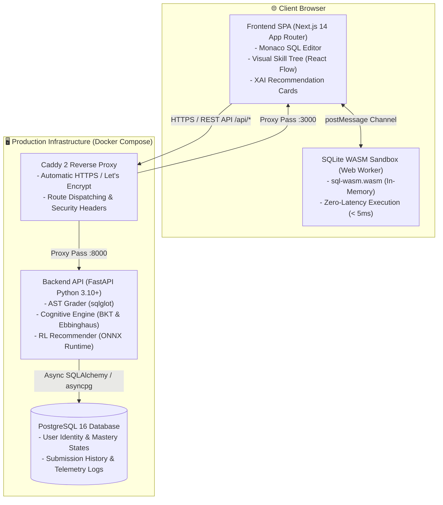

<div align="center">

# 🚀 Ascend LMS — "Rise Above Limits"

**Adaptive Learning Management System for SQL & Database Education**  
*Powered by Two-Stage Reinforcement Learning & Client-Side Zero-Latency WASM Sandbox*

[-success?style=for-the-badge&logo=githubactions)](.github/workflows/ci.yml)
[](docker-compose.yml)
[-black?style=for-the-badge&logo=next.js)](frontend/)
[](backend/)
[](frontend/public/)
[](frontend/)
[](LICENSE)

[Overview](#-project-overview) • [Key Features](#-key-features) • [System Architecture](#-system-architecture) • [Tech Stack](#-technology-stack) • [Quickstart](#-getting-started-quickstart) • [Project Structure](#-monorepo-structure) • [Quality Gates](#-quality-gates--cicd) • [Roadmap](#-development-roadmap)

---

</div>

## 📌 Project Overview

**Ascend LMS** is an intelligent, personalized, and adaptive learning platform designed for Database Management and SQL mastery. Developed as a Capstone Graduation Thesis project in Computer Science, Ascend LMS bridges **rigorous mathematical/cognitive AI modeling**, **production-grade web engineering**, and **zero-friction user experience**.

Unlike conventional learning management systems with static linear curricula, slow server-side code execution, and vulnerability to GenAI copy-pasting, Ascend LMS addresses three fundamental engineering challenges:

1. **Dynamic Personalized Learning Paths:** Combines **Bayesian Knowledge Tracing (BKT)** and the **Ebbinghaus Forgetting Curve** with a **Two-Stage Reinforcement Learning (MaskablePPO)** recommender to personalize exercise difficulty, practice concepts, and spaced repetition intervals.
2. **Zero-Latency In-Browser SQL Execution:** Offloads SQL query compilation and execution entirely to a **Web Worker running SQLite WebAssembly (`sql.js`)** on the client side. Achieves query latencies of **< 50ms** (typically ~1ms) with **zero server compute overhead**, supporting hundreds of concurrent learners on modest server infrastructure.
3. **Multi-Layer Academic Integrity in the GenAI Era:** Protects against copy-paste abuse through **Abstract Syntax Tree (AST)** semantic validation using `sqlglot` (preventing output hardcoding, enforcing index plan adherence), real-time **keystroke telemetry** (0ms paste anomaly detection), and **30-second verification spot-checks**.

---

## ✨ Key Features

### 1. ⚡ Client-Side Zero-Latency SQL Sandbox (SQLite WASM)
- Complete database schema DDL, seed datasets, and user queries run in an isolated browser **Web Worker** via `sql-wasm.wasm`.
- **Ultra-Low Latency:** Instant query feedback in **0.1ms – 5ms**, completely eliminating UI thread locking (Zero UI Jitter).
- **Safety & Resiliency:** Learners can freely run destructive statements (`DROP TABLE`, `DELETE`, `UPDATE`) without affecting the central database. Refreshing the browser instantly re-hydrates the schema and sample data.

### 2. 🧠 Two-Stage Reinforcement Learning Recommender
- **Macro-Action Stage:** The RL policy (`MaskablePPO` compiled to **ONNX Runtime**) processes a 41-dimensional learner cognitive state vector $s_t = [K_t, M_t, H_t, F_t]$ and selects the strategic target `<Concept, Difficulty, LearningMode>`.
- **Micro-Action Stage:** The application layer queries PostgreSQL to retrieve concrete exercises matching the chosen macro strategy.
- **Explainable AI (XAI):** Every recommendation is accompanied by an interpretable rationale card (e.g., *"Reinforcing concept prior to memory decay threshold"*, *"Unlocking prerequisite node on the Knowledge Graph"*).

### 3. 🌳 Interactive Knowledge Graph DAG & Skill Tree
- SQL curriculum is structured as a **Directed Acyclic Graph (DAG)** of 18 core competencies (from basic `SELECT` and `WHERE` to `Multi-Table JOINs`, `Window Functions`, and `Indexing Optimizer`).
- Visual interactive Skill Tree dynamically updates node status and colors based on real-time mastery probabilities computed by BKT.

### 4. 🛡️ AST Semantic Grader & Anti-Cheat Telemetry
- **AST Parsing:** Uses `sqlglot` to parse the Abstract Syntax Tree, detecting and rejecting cheat strategies such as hardcoding literal output values instead of querying relations.
- **Execution Plan Analysis:** Parses `EXPLAIN QUERY PLAN` outputs to verify that learners leverage indexes appropriately rather than performing full table scans.
- **Keystroke Telemetry:** Tracks 0ms paste bursts and tab-switching frequency. Anomalous behaviors trigger a 30-second comprehension spot-check to calibrate true mastery.

### 5. 💡 Monaco Code Editor with Socratic Progressive Hints
- Professional VS Code editing experience via **Monaco Editor** (`vs-dark` theme, line numbers, SQL syntax highlighting, SQL keyword auto-completion, and `Ctrl + Enter` execution shortcut).
- 3-level progressive hints (Socratic questioning $\to$ conceptual reminder $\to$ syntax blueprint) that guide learners without leaking the solution.

---

## 🏗️ System Architecture

Ascend LMS follows a **Micro-Containerized Architecture**, cleanly isolating client-side execution, reverse proxy routing, asynchronous Python backend services, and relational persistence.



---

## 💻 Technology Stack

| Layer | Technology | Rationale & Architectural Purpose |
|---|---|---|
| **Frontend Framework** | **Next.js 14**, React 18, TypeScript 5 | App Router, SSR/SSG for optimized first-contentful paint and type safety. |
| **SQL Code Editor** | **Monaco Editor** (`@monaco-editor/react`) | Industry-standard VS Code editor core with SQL autocomplete and keybinding support. |
| **Client SQL Engine** | **sql.js** (SQLite WebAssembly) | Zero-latency in-memory query execution in dedicated Web Worker threads. |
| **Styling & UI** | **Tailwind CSS**, PostCSS, Lucide Icons | Responsive dark-mode interface with zero runtime CSS-in-JS overhead. |
| **Backend API** | **FastAPI** (Python 3.10+), Uvicorn | High-throughput asynchronous REST API with auto-generated OpenAPI / Swagger docs. |
| **AI / Machine Learning** | **Gymnasium**, `sb3-contrib` (MaskablePPO), **ONNX Runtime** | Cognitive simulation via BKT + Ebbinghaus; lightweight sub-15ms inference without PyTorch. |
| **AST Analysis** | **sqlglot** | Deep SQL syntactic and semantic tree analysis for robust anti-cheat grading. |
| **Database & Migration** | **PostgreSQL 16**, SQLAlchemy (asyncpg), Alembic | ACID-compliant relational persistence with native JSONB telemetry storage. |
| **Reverse Proxy** | **Caddy 2** | Production-ready HTTP/2 & HTTPS reverse proxy with automated SSL management. |
| **DevOps & Quality Gates**| **Docker Compose**, **GitHub Actions**, Husky, lint-staged | One-command reproducible local environment; strict 5-gate automated CI pipeline. |

---

## 🚀 Getting Started (Quickstart)

### Prerequisites
- [Docker](https://docs.docker.com/get-docker/) & [Docker Compose](https://docs.docker.com/compose/) (Docker Desktop recommended on Windows/macOS).
- [Node.js](https://nodejs.org/) v20+ & [npm](https://www.npmjs.com/) (for host-level frontend development).
- [Python](https://www.python.org/) 3.10+ (for host-level backend development).

---

### Option 1: Instant Launch with Docker Compose (Recommended)

To spin up the entire multi-container environment (PostgreSQL, FastAPI Backend, Next.js Frontend, and Caddy Reverse Proxy):

```bash
# 1. Clone repository
git clone https://github.com/diepvanhieu25-tech/ascend-lms.git
cd ascend-lms

# 2. Copy sample environment file
cp .env.example .env

# 3. Build and launch all services in detached mode
docker compose up -d --build
```

Once all containers report `healthy`, access the platform at:

| Service / Endpoint | URL | Description |
|---|---|---|
| **Unified Web Gateway (Caddy)** | [http://localhost](http://localhost) | Reverse-proxied port 80 (routes `/api/*` to backend) |
| **SQLite WASM Sandbox PoC** | [http://localhost/poc/sqlite](http://localhost/poc/sqlite) | In-browser Monaco SQL editor & Web Worker sandbox |
| **Frontend Web App (Direct)** | [http://localhost:3000](http://localhost:3000) | Next.js standalone container port |
| **Backend API Docs (Swagger)** | [http://localhost/docs](http://localhost/docs) | Interactive OpenAPI documentation |
| **Backend Health Check** | [http://localhost:8000/api/v1/health](http://localhost:8000/api/v1/health) | Direct backend health diagnostic |

To stop all containers:
```bash
docker compose down
```

---

### Option 2: Local Development Setup (Without Docker)

#### 1. Backend Service (FastAPI)
```bash
cd backend
python3 -m venv venv
source venv/bin/activate  # On Windows: venv\Scripts\activate
pip install -r requirements.txt
uvicorn app.main:app --reload --port 8000
```

#### 2. Frontend Application (Next.js)
```bash
cd frontend
npm install
npm run dev
```
Open [http://localhost:3000](http://localhost:3000) in your browser.

---

## 📁 Monorepo Structure

```text
ascend-lms/
├── .github/
│   └── workflows/
│       └── ci.yml                 # Automated 5-Gate CI Pipeline
├── .husky/                        # Git pre-commit hooks (Husky + lint-staged)
├── .onion/                        # Technical specifications & mathematical models
│   ├── API-CONTRACTS.md           # Interface contracts between Frontend and Backend
│   ├── SPEC-lms-frontend.md       # Frontend UI & Web Worker specifications
│   ├── SPEC-lms-backend.md        # Backend domain models & API architecture
│   ├── SPEC-sql-engine.md         # Sandbox and AST grading specifications
│   └── SYSTEM-ANALYSIS-ARCHITECTURE.md
├── backend/                       # Python FastAPI Backend service
│   ├── app/
│   │   ├── core/                  # Settings, security, environment configurations
│   │   └── main.py                # FastAPI application entrypoint
│   ├── tests/                     # Pytest automated test suite
│   ├── Dockerfile                 # Multi-stage production container for backend
│   └── pyproject.toml             # Ruff linter & Pytest configurations
├── frontend/                      # Next.js 14 Web Application
│   ├── public/
│   │   ├── sql-wasm.js            # Emscripten loader for SQLite WASM
│   │   ├── sql-wasm.wasm          # SQLite WebAssembly binary (in-memory execution)
│   │   └── sqlite.worker.js       # Dedicated standalone Web Worker
│   ├── src/
│   │   ├── app/
│   │   │   ├── poc/sqlite/        # SQLite WASM Sandbox playground page
│   │   │   ├── globals.css        # Tailwind CSS directives
│   │   │   └── page.tsx           # Landing page
│   │   ├── components/
│   │   │   └── editor/            # Monaco SQLEditor component with Ctrl+Enter binding
│   │   └── hooks/
│   │       └── useSQLiteWorker.ts # React custom hook managing Web Worker lifecycle
│   ├── Dockerfile                 # Next.js standalone container
│   ├── package.json               # Frontend dependencies and scripts
│   └── postcss.config.js          # PostCSS / Tailwind CSS configuration
├── tasks/
│   ├── plan.md                    # 6-phase master execution plan
│   └── todo.md                    # Detailed progress tracking board
├── Caddyfile                      # Caddy 2 reverse proxy configuration
├── CONSTRAINTS.md                 # Project technical standards & non-negotiables
├── docker-compose.yml             # Local multi-service orchestration
├── HLD.md                         # High-Level Design specification
├── LLD.md                         # Low-Level Design specification
└── README.md                      # Project documentation entrypoint
```

---

## 🧪 Quality Gates & CI/CD

To ensure code quality and prevent technical debt, this project enforces strict quality gates codified in [`CONSTRAINTS.md`](CONSTRAINTS.md). Every Pull Request targeting `main` must pass **5 Automated GitHub Actions Quality Gates**:

1. **Gate 1: Linting & Code Formatting**
   - Backend: `ruff check app/ tests/` and `ruff format --check`
   - Frontend: `npm run lint` (ESLint with zero warnings/errors)
2. **Gate 2: Static Type Checking**
   - Backend: `mypy app/` (Strict mode)
   - Frontend: `tsc --noEmit` (TypeScript 0 error policy)
3. **Gate 3: Automated Unit & Benchmark Testing**
   - Backend: `pytest --cov=app --cov-fail-under=80`
   - Frontend: `vitest --run` (SQLite WASM execution benchmark `< 50ms`)
4. **Gate 4: Container Build Verification**
   - Independent multi-stage Docker builds for backend and frontend images
5. **Gate 5: Security & Anti-Suppression Verification**
   - Automated scan forbidding check suppressions (e.g., `@ts-ignore`, `eslint-disable`, `# noqa`) and unhandled stubs.

---

## 🗺️ Development Roadmap

- [x] **Phase 1: Technical De-risking & Infrastructure**
  - [x] Monorepo initialization with Git workflows, Husky, and lint-staged.
  - [x] Multi-container Docker Compose setup (Caddy, Next.js, FastAPI, PostgreSQL).
  - [x] Automated 5-Gate GitHub Actions CI pipeline.
  - [x] Proof-of-Concept SQLite WASM Web Worker sandbox (`< 50ms` execution threshold verified).
- [ ] **Phase 2: Database Schema & AST Semantic Grader**
  - [ ] Complete ERD schema design with Alembic migrations.
  - [ ] `sqlglot` AST grader for hardcoding detection and `EXPLAIN QUERY PLAN` validation.
- [ ] **Phase 3: Cognitive Simulator & AI Training**
  - [ ] Mathematical implementation of BKT state updating and Ebbinghaus memory decay.
  - [ ] `gymnasium.Env` synthetic student simulation and `MaskablePPO` policy training.
  - [ ] Model export to ONNX runtime format for low-latency backend inference.
- [ ] **Phase 4: LMS Backend API & Anti-Cheat Engine**
  - [ ] Recommendation, authentication, and diagnostic placement test endpoints.
  - [ ] Keystroke telemetry processing and 30-second calibration spot-checks.
- [ ] **Phase 5: Next.js Frontend & Interactive Experience**
  - [ ] Interactive Knowledge Graph visual skill tree (`@xyflow/react`).
  - [ ] Full practice interface with 3-tier progressive Socratic hints.
  - [ ] Instructor dashboard featuring Frustration Heatmap and drift metrics.
- [ ] **Phase 6: Load Testing, Production Deployment & Thesis Defense**
  - [ ] 500 CCU load testing and Core Web Vitals optimization (Lighthouse > 90).
  - [ ] Production deployment and thesis defense documentation.

---

## 📜 License

This project is licensed under the terms of the **MIT License**. See the [LICENSE](LICENSE) file for details.

---

<div align="center">
  <sub>Engineered with ❤️ for the <b>Computer Science Graduation Thesis — Ascend LMS</b></sub>
</div>
